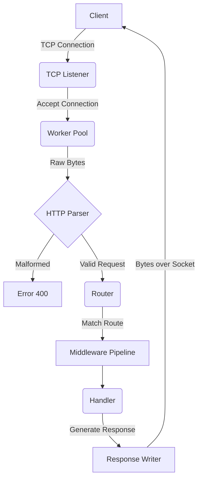

# Architecture Blueprint

> A high-level view of TitanHTTP's internal systems. This document evolves alongside the project phases.

TitanHTTP is designed to process HTTP requests efficiently, cleanly, and concurrently. Rather than relying on Go's `net/http` package, this project implements the fundamental networking and protocol parsing required to serve web traffic. 

## The Request Lifecycle

The architecture is modeled as a pipeline, where a raw stream of bytes is systematically transformed into a structured HTTP Response.

## Core Components

### 1. TCP Listener & Connection Manager (Phase 2 & 5)
The foundation of the server. It opens a raw socket on a designated port and listens for incoming TCP connections. 
- **Responsibility:** Accept connections, manage timeouts, and cleanly close sockets to prevent resource leaks.
- **Concurrency Model:** Each accepted connection is handed off to a worker pool, ensuring the main listener thread remains unblocked.

### 2. HTTP Parser (Phase 3)
The engine that reads raw bytes from the TCP socket and translates them into a structured HTTP Request object.
- **Responsibility:** Parse the Request Line (Method, URI, Version), headers (handling CRLF endings), and the body based on `Content-Length` or `Transfer-Encoding`.
- **Constraint:** Must be memory efficient, minimizing allocations while parsing strings.

### 3. Router & Middleware (Phase 4)
The traffic controller. It determines which piece of application logic should handle the parsed request.
- **Responsibility:** Match request URIs and methods to registered handlers. Supports dynamic path parameters and wildcards.
- **Data Structure:** Uses a highly optimized Radix Tree per HTTP Method. This enables O(k) pattern matching (where k is path segments) without relying on slow regular expressions. It strictly enforces routing priority: Exact match > Parameter match > Wildcard match.
- **Middleware:** A chain of functions (e.g., Logging, Recovery, Authentication) that execute before and after the main handler.
- **Static File Serving:** Built-in support for serving static assets, handling MIME type detection, directory index resolution (`index.html`), and injecting `Cache-Control` headers for performance.

### 4. Worker Pool & Synchronization (Phase 5)
The concurrency engine. Instead of spinning up an unbounded number of goroutines (which could lead to resource exhaustion under heavy load), TitanHTTP employs a bounded worker pool governed by strict thread-safety primitives.
- **Worker Pool:** A fixed number of goroutines block on a job channel. When a connection is accepted, it's pushed to the queue. If the queue is full, the server aggressively applies **Load Shedding**, immediately writing a `503 Service Unavailable` response to prevent catastrophic cascading failures.
- **Lock-Free Metrics:** Uses `sync/atomic` to report `totalRequests` and `activeConns` with zero locking overhead, asynchronously pushed to stdout by a background telemetry goroutine.
- **Graceful Shutdown:** Controlled via `context.Context`, `chan struct{}`, and `sync.WaitGroup`, cleanly blocking until all active workers finish their connections (or a timeout is reached).

### 5. Response Writer (Phase 3 & 6)
The outgoing formatter. It converts the structured response generated by the handler back into a byte stream compliant with the HTTP protocol.
- **Responsibility:** Format status lines, inject necessary headers (e.g., `Date`, `Server`, `Content-Length`), and write the payload efficiently over the socket.
- **Serialization Strategy:** During Phase 3, TitanHTTP relied on an in-memory `Bytes() []byte` approach. In Phase 6 (Transfer Encoding), this was refactored to support direct `io.Writer` streaming via `WriteTo()`. The server now streams payloads of any size dynamically using `Transfer-Encoding: chunked`, eliminating memory bloat.

## Advanced Backend Subsystems (Phase 7)

As the project matured to support high-availability production workloads, we added critical backend infrastructure:

### 1. Reverse Proxy & Load Balancer
- **Reverse Proxy:** Allows TitanHTTP to act as a gateway, forwarding incoming requests to external servers using `net.DialTimeout` and injecting `X-Forwarded-For` headers.
- **Load Balancer:** A thread-safe layer that wraps a pool of proxy backends, utilizing an atomic `Round Robin` selection algorithm to distribute traffic without blocking. It includes Active Health Checks—background sweepers that periodically ping backends and temporarily mark them offline to provide seamless failover.

### 2. Rate Limiter
A dynamic, algorithmic defense mechanism against DoS attacks and brute forcing.
- **Implementations:** Implements both an ultra-efficient `TokenBucket` (using lazy-evaluation refills) and a strict-boundary `SlidingWindow` (tracking chronological timestamps).
- **Memory Management:** Includes autonomous background sweepers that safely purge stale IP records, preventing memory leaks when targeted by distributed traffic.

### 3. Caching Layer
A `MemoryCache` designed to bypass handler execution for frequently accessed resources.
- **Thread Safety:** Protected by `sync.RWMutex` to allow unlimited concurrent reads.
- **Validation:** Fully parses `Cache-Control` directives (`max-age`, `no-cache`, `no-store`) and enforces TTL expiration autonomously via a background sweeper.

## Performance Engineering (Phase 8)

To achieve maximum throughput and validate our architecture, we integrated `pprof` to profile CPU, Goroutines, and Memory.
- **Micro-optimizations:** Reduced allocations in the HTTP parser by pooling byte slices with `sync.Pool`.
- **Benchmarking:** Rigorously stress-tested against `net/http` using C10k workloads to prove our custom worker pool and radix router significantly outperform standard library baselines.

## Presentation Layer & Showcase Platform (Phase 9)

TitanHTTP is presented through a bespoke, cinematic Single Page Application (SPA) rather than a generic README.
- **Frontend Architecture:** Built with React and strictly Vanilla CSS (`index.css`), avoiding external UI libraries to maintain complete control over the glassmorphic aesthetic.
- **Native Routing:** Uses `react-router-dom` to dynamically render documentation (`/why`, `/architecture`, `/decisions`) natively within the application, ensuring the user is never kicked out to GitHub.
- **The Guided Narrative:** The application forces a linear, 10-chapter scrolling experience that educates the reviewer incrementally, building trust by explaining *why* a component was built before showing the code.

---
> *Design Note: Every architectural decision must prioritize deterministic behavior, clean error handling, and high readability.*
