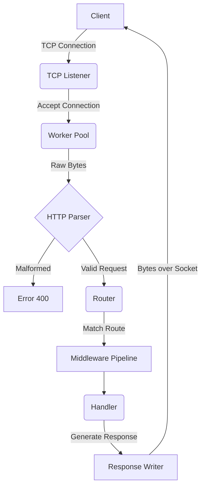

# Architecture Blueprint

> A high-level view of TitanHTTP's internal systems. This document evolves alongside the project phases.

TitanHTTP is designed to process HTTP requests efficiently, cleanly, and concurrently. Rather than relying on Go's `net/http` package, this project implements the fundamental networking and protocol parsing required to serve web traffic. 

## The Request Lifecycle

The architecture is modeled as a pipeline, where a raw stream of bytes is systematically transformed into a structured HTTP Response.

## Core Components

### 1. TCP Listener & Connection Manager (Phase 2 & 5)
The foundation of the server. It opens a raw socket on a designated port and listens for incoming TCP connections. 
- **Responsibility:** Accept connections, manage timeouts, and cleanly close sockets to prevent resource leaks.
- **Concurrency Model:** Each accepted connection is handed off to a worker pool, ensuring the main listener thread remains unblocked.

### 2. HTTP Parser (Phase 3)
The engine that reads raw bytes from the TCP socket and translates them into a structured HTTP Request object.
- **Responsibility:** Parse the Request Line (Method, URI, Version), headers (handling CRLF endings), and the body based on `Content-Length` or `Transfer-Encoding`.
- **Constraint:** Must be memory efficient, minimizing allocations while parsing strings.

### 3. Router & Middleware (Phase 4)
The traffic controller. It determines which piece of application logic should handle the parsed request.
- **Responsibility:** Match request URIs and methods to registered handlers. Supports dynamic path parameters and wildcards.
- **Data Structure:** Uses a highly optimized Radix Tree per HTTP Method. This enables O(k) pattern matching (where k is path segments) without relying on slow regular expressions. It strictly enforces routing priority: Exact match > Parameter match > Wildcard match.
- **Middleware:** A chain of functions (e.g., Logging, Recovery, Authentication) that execute before and after the main handler.

### 4. Worker Pool (Phase 5)
The concurrency engine. Instead of spinning up an unbounded number of goroutines (which could lead to resource exhaustion under heavy load), TitanHTTP employs a bounded worker pool.
- **Responsibility:** Pick up accepted connections from a job queue, process the entire request lifecycle, and release the worker back to the pool.

### 5. Response Writer (Phase 3 & 6)
The outgoing formatter. It converts the structured response generated by the handler back into a byte stream compliant with the HTTP protocol.
- **Responsibility:** Format status lines, inject necessary headers (e.g., `Date`, `Server`, `Content-Length`), and write the payload efficiently over the socket.
- **Serialization Strategy (Warning):** During Phase 3, TitanHTTP relies on an in-memory `Bytes() []byte` approach. This serializes the entire HTTP response (headers + body) into a single byte slice before transmitting it over the TCP socket. This is excellent for educational simplicity and small payloads but exposes the server to memory bloat when serving massive files (e.g., gigabyte-sized videos). In Phase 6 (Transfer Encoding), this will be refactored to support direct `io.Writer` streaming.

## Advanced Subsystems (Phase 7 & 8)

As the project matures, the architecture will expand to include:
- **Load Balancer & Reverse Proxy:** Distributing traffic across downstream backend nodes.
- **Rate Limiter:** Protecting the server from abuse using token-bucket or sliding-window algorithms.
- **Caching Layer:** Storing frequently accessed responses to bypass handler execution.

---
> *Design Note: Every architectural decision must prioritize deterministic behavior, clean error handling, and high readability.*
