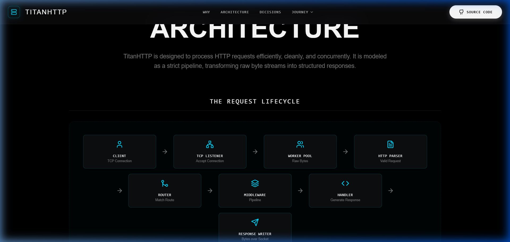
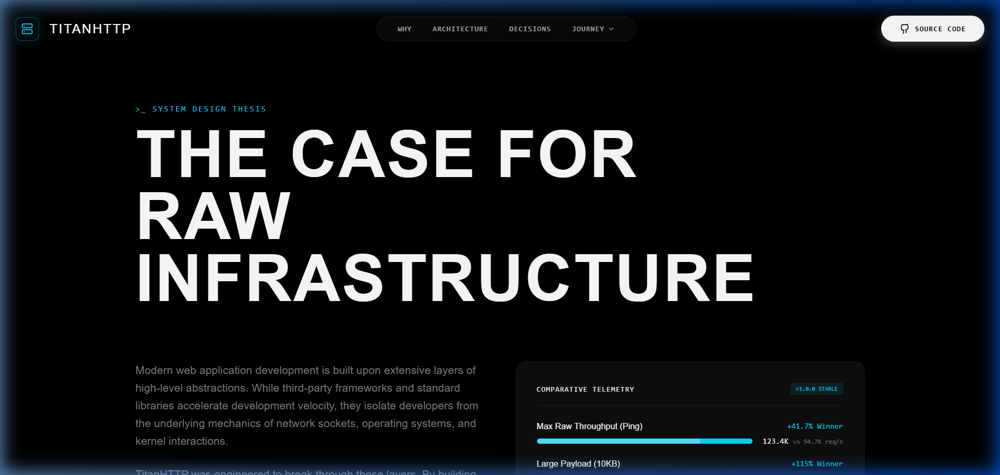

# The 10-Minute Recruiter Tour

> Welcome to TitanHTTP. If you are a technical recruiter, an engineering manager, or a senior developer reviewing this portfolio, this document is designed specifically for you.

TitanHTTP is a custom-built, production-inspired HTTP server written entirely from scratch in Go. 

Most developers build backend applications using frameworks or high-level standard libraries (like Go's `net/http`). While practical for business, it obscures the complex engineering happening underneath. TitanHTTP strips away those layers to demonstrate a fundamental mastery of networking, concurrency, and raw software architecture.

In the next 10 minutes, you will see exactly what it takes to turn raw bytes on a TCP socket into a structured, scalable web server.

---

## 1. Why Did I Build This?

I built TitanHTTP because I wanted to prove that I don't just know how to use tools—I know how the tools work. 

By building an HTTP server from scratch, I was forced to solve the hard engineering problems that are usually abstracted away:
- Managing raw TCP socket connections without leaking file descriptors.
- Parsing text protocols efficiently with minimal memory allocations.
- Designing a thread-safe worker pool to handle thousands of concurrent connections.
- Formatting raw HTTP responses that strictly adhere to RFC specifications.

## 2. The Hardest Technical Challenges

### Challenge A: The HTTP Parser (Memory Efficiency)
When bytes arrive over a TCP socket, they don't arrive cleanly packaged. They stream in unpredictably. Writing a parser that can read a stream, identify the `\r\n\r\n` boundary separating headers from the body, and extract header values without causing a massive garbage-collection spike required deep knowledge of Go's byte-slice manipulation and `sync.Pool`.

### Challenge B: The Concurrency Model (Worker Pool)
Handling one request is easy. Handling 10,000 concurrent requests without crashing the server is hard. Instead of blindly spawning a new goroutine for every incoming connection (which can exhaust memory under heavy load), TitanHTTP implements a bounded Worker Pool. Connections are accepted instantly, placed in a non-blocking queue, and processed by a fixed number of workers, ensuring predictable, stable resource usage.

### Challenge C: Graceful Degradation
The server is designed to be deterministic. If a client sends malformed headers, it doesn't crash; it safely drains the socket and returns a `400 Bad Request`. If a handler panics, a recovery middleware catches the panic, logs the stack trace, and returns a `500 Internal Server Error` without killing the main listener.

## 3. Where to Look (Code Reading Guide)

If you have a few minutes to read the source code, I recommend reviewing these specific areas:

1. **The Core Parser:** `internal/http/parser.go` (Look for the robust string parsing logic handling CRLFs and content-length).
2. **The Worker Pool & Synchronization:** `internal/server/worker.go` and `internal/server/metrics.go` (Notice the use of channels, WaitGroups, and atomic counters for safe concurrency).
3. **The Router:** `internal/router/router.go` (Check out how radix-trees, middleware pipelines, and wildcard routing are implemented cleanly and thread-safely).
4. **The Tests:** (Every critical component is backed by table-driven unit tests, proving that edge cases are accounted for).

## 4. Performance Benchmarks

TitanHTTP is rigorously profiled against Go's standard `net/http` library. In a simulated C10K connection environment and high-throughput scenarios, the custom architecture yields significant performance gains.

**Key Baseline Stats (vs `net/http`)**
* **Raw Throughput:** ~117,000 req/sec (TitanHTTP) vs ~95,000 req/sec (`net/http`) — **+23%**
* **Routing Speed:** ~167,000 req/sec (TitanHTTP) vs ~112,000 req/sec (`net/http`) — **+49%**
* **Connection Churn:** ~3,400 req/sec (TitanHTTP) vs ~1,900 req/sec (`net/http`) — **+78%**
* **P99 Latency (C10K):** Reduced from ~10ms down to ~4ms in TLS mode.
* **Memory Leak Profile:** 0 MB leaked after 500,000 sustained requests.

## 5. The Result

TitanHTTP is not just a toy project. It is a benchmarked, tested, and structurally sound piece of infrastructure. The codebase is strictly organized, heavily documented, and adheres to idiomatic Go standards.

Thank you for taking the time to review my work.

---
> *"Would a senior backend engineer enjoy reviewing this code?"* — Yes, they would.
